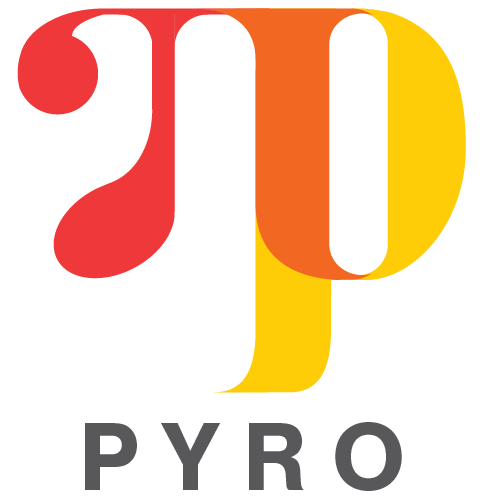

<div align="center">
  <a href="http://pyro.ai"> </a>
</div>

-----------------------------------------

[](https://travis-ci.org/uber/pyro)
[](https://codecov.io/github/uber/pyro)
[](https://pypi.python.org/pypi/pyro-ppl)
[](http://pyro-ppl.readthedocs.io/en/stable/?badge=dev)


[Getting Started](http://pyro.ai/examples) |
[Documentation](http://docs.pyro.ai/) |
[Community](http://forum.pyro.ai/) |
[Contributing](https://github.com/uber/pyro/blob/master/CONTRIBUTING.md)

Pyro is a flexible, scalable deep probabilistic programming library built on PyTorch.  Notably, it was designed with these principles in mind:
- **Universal**: Pyro is a universal PPL -- it can represent any computable probability distribution.
- **Scalable**: Pyro scales to large data sets with little overhead compared to hand-written code.
- **Minimal**: Pyro is agile and maintainable. It is implemented with a small core of powerful, composable abstractions.
- **Flexible**: Pyro aims for automation when you want it, control when you need it. This is accomplished through high-level abstractions to express generative and inference models, while allowing experts easy-access to customize inference.

Pyro is in an alpha release.  It is developed and used by [Uber AI Labs](http://uber.ai).
For more information, check out our [blog post](http://eng.uber.com/pyro).

## Installing

### Installing a stable Pyro release

First install [PyTorch](http://pytorch.org/).

Install via pip:

**Python 2.7.\*:**
```sh
pip install pyro-ppl
```

**Python 3.5:**
```sh
pip3 install pyro-ppl
```

**Install from source:**
```sh
git clone git@github.com:uber/pyro.git
cd pyro
git checkout master  # master is pinned to the latest release
pip install .
```

**Install with extra packages:**
```sh
pip install pyro-ppl[extras]  # for running examples/tutorials
```

### Installing Pyro dev branch

For recent features you can install Pyro from source.

To install a compatible CPU version of PyTorch on OSX / Linux, you
could use the PyTorch install helper script.

```
bash scripts/install_pytorch.sh
```

Alternatively, build PyTorch following instructions in the PyTorch
[README](https://github.com/pytorch/pytorch/blob/master/README.md).
```sh
git clone --recursive https://github.com/pytorch/pytorch
cd pytorch
git checkout 200fb22  # <---- a well-tested commit
```
On Linux:
```sh
python setup.py install
```
On OSX:
```sh
MACOSX_DEPLOYMENT_TARGET=10.9 CC=clang CXX=clang++ python setup.py install
```

Finally install Pyro
```sh
git clone https://github.com/uber/pyro
cd pyro
pip install .
```


### Installing Pyro's branch tracking PyTorch 1.0 release

To use Pyro features that are under active development and only available
with the PyTorch's forthcoming 1.0 release e.g. JIT compilation, you will
need to use the `pytorch-1.0` branch of Pyro.

First install the PyTorch release candidate using the Preview tab from
the [PyTorch](https://pytorch.org/) website. Alternatively, you could
build PyTorch following instructions in the PyTorch
[README](https://github.com/pytorch/pytorch/blob/master/README.md).

Then, install Pyro using the `pytorch-1.0` branch.

**Install using pip:**

```sh
pip install git+https://github.com/uber/pyro.git@pytorch-1.0
```

or, with the `extras` dependency to run examples/tutorials.
```sh
pip install -e git+https://github.com/uber/pyro.git@pytorch-1.0#egg=project[extras]
```

**Install from source:**

```sh
git clone https://github.com/uber/pyro
cd pyro
git checkout pytorch-1.0  # branch compatible with PyTorch 1.0 release candidate
pip install .  # pip install .[extras] for running examples/tutorials
```

## Running Pyro from a Docker Container

Refer to the instructions [here](docker/README.md).

## Citation
If you use Pyro, please consider citing:
```
@article{bingham2018pyro,
  author = {Bingham, Eli and Chen, Jonathan P. and Jankowiak, Martin and Obermeyer, Fritz and Pradhan, Neeraj and Karaletsos, Theofanis and Singh, Rohit and Szerlip, Paul and Horsfall, Paul and Goodman, Noah D.},
  title = {{Pyro: Deep Universal Probabilistic Programming}},
  journal = {arXiv preprint arXiv:1810.09538},
  year = {2018}
}
```
