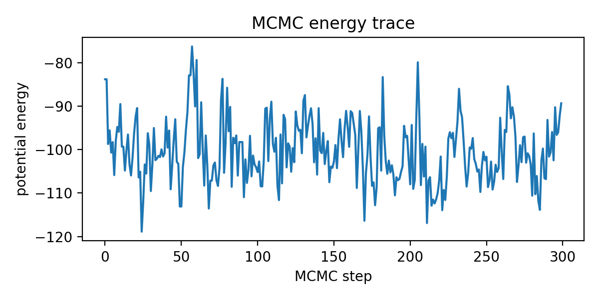

Epidemiological inference via HMC
=================================

This tutorial is in the form of a script (see below).

Example Usage
-------------

The following example
runs the script to generate outbreak data for a population of 10000 observed
for 60 days, then infer infection parameters and forecast new infections for
another 30 days. This takes about 3 minutes on my laptop.

.. code-block:: none

    $ python examples/sir_hmc.py -p 10000 -d 60 -f 30 --plot
    Generating data...
    Observed 452/871 infections:
    0 0 2 1 2 0 0 3 2 0 1 3 1 3 0 1 0 6 4 3 6 4 4 3 3 3 5 3 3 3 5 1 4 6 4 2 6 8 7 4 11 8 14 9 17 13 9 14 10 15 16 22 20 22 19 20 28 25 23 21
    Running inference...
    Sample: 100%|=========================| 300/300 [02:35,  1.93it/s, step size=9.67e-02, acc. prob=0.878]

                    mean       std    median      5.0%     95.0%     n_eff     r_hat
            R0      1.40      0.07      1.40      1.28      1.49     26.56      1.06
           rho      0.47      0.02      0.47      0.44      0.52      7.08      1.22
      S_aux[0]   9998.74      0.64   9998.75   9997.84   9999.67     28.74      1.00
      S_aux[1]   9998.37      0.72   9998.38   9997.28   9999.44     52.24      1.02
      ...
      I_aux[0]      1.11      0.64      0.99      0.19      2.02     22.01      1.00
      I_aux[1]      1.55      0.74      1.65      0.05      2.47     10.05      1.10
      ...

    Number of divergences: 0
    R0: truth = 1.5, estimate = 1.4 ± 0.0654
    rho: truth = 0.5, estimate = 0.475 ± 0.023

.. image:: _static/img/sir_hmc/forecast.png
    :alt: Forecast of new infections

.. image:: _static/img/sir_hmc/parameters.png
    :width: 30em
    :alt: Posterior distribution over parameters

Tutorial Script
---------------

`View sir_hmc.py on github`__

.. _github: https://github.com/pyro-ppl/pyro/blob/dev/examples/sir_hmc.py

__ github_

.. literalinclude:: ../../examples/sir_hmc.py
    :language: python

