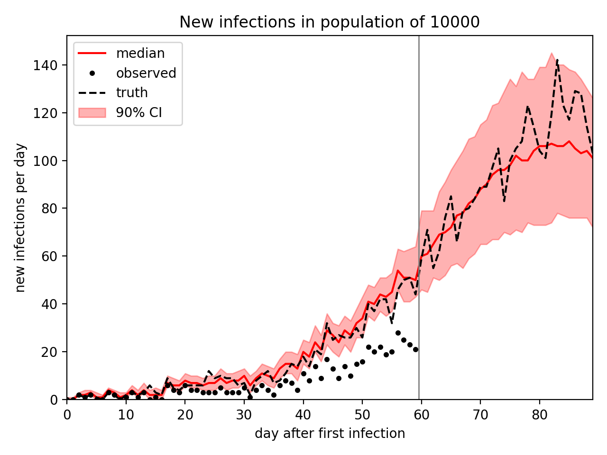
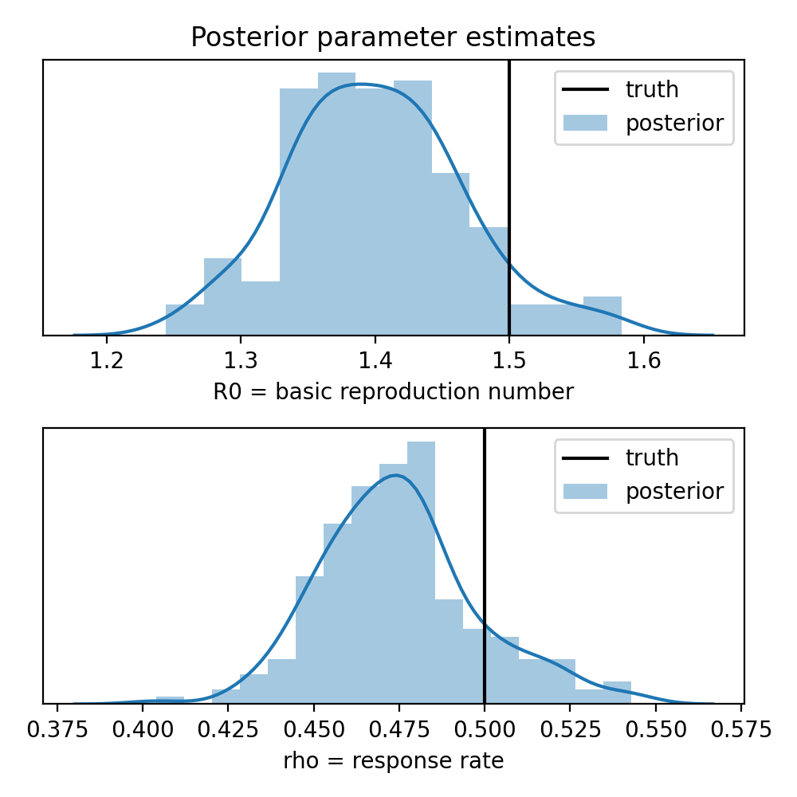

Compartmental Epidemiological Models
====================================

This tutorial is in the form of a script (see below).

Example Usage
-------------

The following example
runs the script to generate outbreak data for a population of 10000 observed
for 60 days, then infer infection parameters and forecast new infections for
another 30 days. This takes about 3 minutes on my laptop.

.. code-block:: none

    $ python -O examples/sir_hmc.py -p 10000 -d 60 -f 30 --plot
    ...
    Generated 452 observed infections:
    0 0 2 1 2 0 0 3 2 0 1 3 1 3 0 1 0 6 4 3 6 4 4 3 3 3 5 3 3 3 5 1 4 6 4 2 6 8 7 4 11 8 14 9 17 13 9 14 10 15 16 22 20 22 19 20 28 25 23 21
    Running inference...
    Sample: 100%|==========================| 300/300 [02:52,  1.74it/s, step size=1.12e-01, acc. prob=0.747]

                mean       std    median      5.0%     95.0%     n_eff     r_hat
        R0      1.41      0.13      1.39      1.21      1.63      7.03      1.14
       tau      7.46      1.32      7.01      5.65      9.68      5.38      1.29
       rho      0.55      0.03      0.55      0.49      0.59      4.83      1.44
       ...

    Number of divergences: 0
    R0: truth = 1.5, estimate = 1.41 ± 0.134
    tau: truth = 7, estimate = 7.46 ± 1.32
    rho: truth = 0.5, estimate = 0.546 ± 0.0297

.. image:: _static/img/sir_hmc/energy-trace.png
    :width: 30em
    :alt: Trace plot of potential energy

Tutorial Script
---------------

`View sir_hmc.py on github`__

.. _github: https://github.com/pyro-ppl/pyro/blob/dev/examples/sir_hmc.py

__ github_

.. literalinclude:: ../../examples/sir_hmc.py
    :language: python

